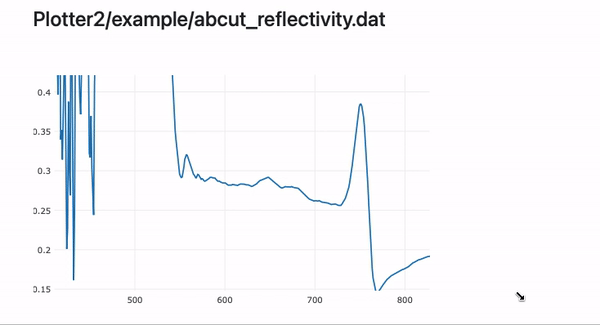

# HTTPHandler
HTTP Handler for TCP Server designed for Wolfram Kernel (Mathematica, Engine)

## Installation
Via Wolfram Paclet system
```mathematica
PacletInstall["KirillBelov/HTTPHandler"]
```

## Examples
Clone this repository
```bash
git clone https://github.com/KirillBelovTest/HTTPHandler
cd HTTPHandler
```

There is a set of usefull example, that helps to understand the logic of a webserver and its applications

### APIFunction 💎
This basically replicates the functionalify of Wolfram `APIFunction` available in Cloud only. However, using our approach one can run it locally
```bash
wolframscript -f Examples/APIFunction.wls
```
then open your browser at
```
http://127.0.0.1:8000/cellular?rule=69&step=500
http://127.0.0.1:8000/bars?v=1,2,3,4,5,6
```

what it does, it provides the URL parameters to the defined API function and generates the result for the reply


### StaticWebsite 📯
This is a simple example of templating using `StringTemplate` to embed the data into an html document from the request parameters or call an arbitary Wolfram Language function 

```bash
wolframscript -f Examples/StaticWebsite.wls
```


It also shows how to work with media files and paths for the server. Those two WL logos are requested from two different folders, specified in `Base` parameters as an array of paths. Also the current date and a list with request parameters shows how to embed the WL function into the document. 

### FormExample 🪩
A bit more advanced example - a follow up to `APIFunction` - that unleash to power of modern HTML/CSS stack and POST method. It relies on [Wolfram Script Pages](https://github.com/JerryI/wl-wsp) framework for easier templating bringing simillar experiense if you was writting in PHP

```bash
wolframscript -f Examples/FormExample.wls
```

One can design anything in any share, using its favourite JS/CSS framework. Here Bootstrap is used. It has almost no limitations, when it comes to the static content generation compared to Wolfram Cloud


Each time you drag a slider and click to `Submit` button, it sends POST request, recalculates a new plot and sends to a user. No JS required, just old good HTTP and reqular forms processing.

### POST 🔧
This is a demonstartion of how to work with POST request. It can process only text files and text data unfortonately. When you upload the data and submit it, it redirects to the specified page, while the recived data is printed to the console

```bash
wolframscript -f Examples/POST.wls
```

### WSP 🔩
This demo shows on how to work with WSP ([Wolfram Script Pages](https://github.com/JerryI/wl-wsp)) template engine and generate content based on user's request passed via URL parameters

```bash
wolframscript -f Examples/WSP.wls
```

*index.wsp*
```php
<?wsp With[{color = $CurrentRequest["Query", "color"]}, ?>
    <div style="width:100px; height:100px; background-color: <?wsp color ?>"></div>
<?wsp ] ?>
```

As one can see, it puts a color variable into the style of a `div` element. Then if one open a page at 

```
http://127.0.0.1:8000/?color=cyan
```

it will show


### Plotter ⚗️
This features a file explorer & graph viewer made out of independent components simillar to what people do in a modern WEB

```bash
wolframscript -f Examples/Plotter.wls
```

One can navigate through the folders


and open the sample data


For each file there is a `view.wsp` component that generates SVG image and embeds it into a page.

> Cool, ha? Thinking about what you can do, makes Wolfram Cloud to be just a toy for the rich kids - @JerryI

### Plotter2 🔭
One could go even further utulizing the power of [WebSockets](https://github.com/KirillBelovTest/WebSocketHandler) and [WLJS](https://github.com/JerryI/wljs-interpreter) (a tiny Wolfram Language Interpreter running in a browser). So that we do not need to spend resources on generating ugly static SVGs, but providing just the raw data and make browser and Javascript to do the actual plotting

```bash
wolframscript -f Examples/Plotter2.wls
```

The naviagtion is the same, but when a user opens a file it shows a placeholde, while Javascript is pumping the data from the server via WebSockets (aka hydrate the HTML element) and then plots the received data



This is not about rocket science, but a combination of a few simple open-source tools, that moves Wolram Language beyong the notebook interface
